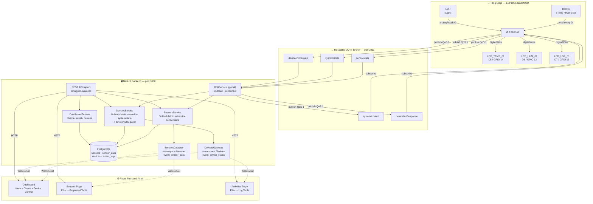
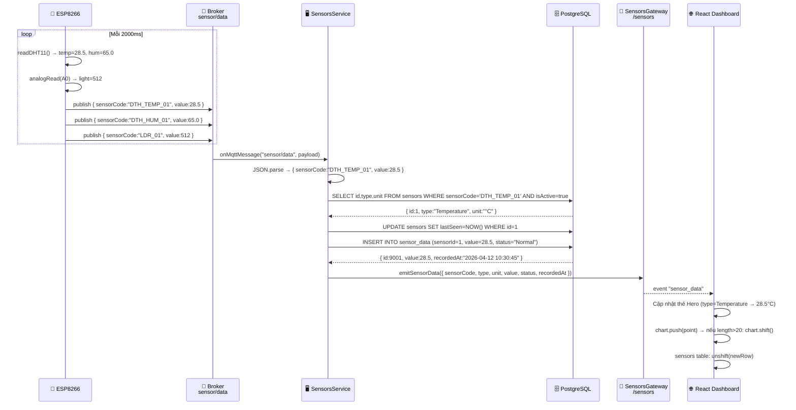
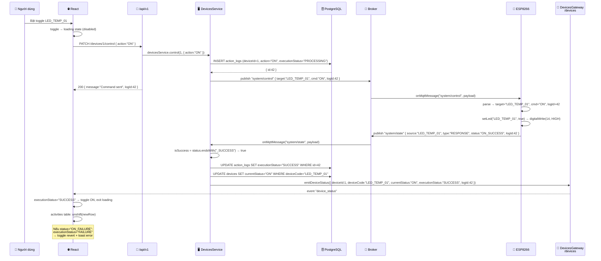
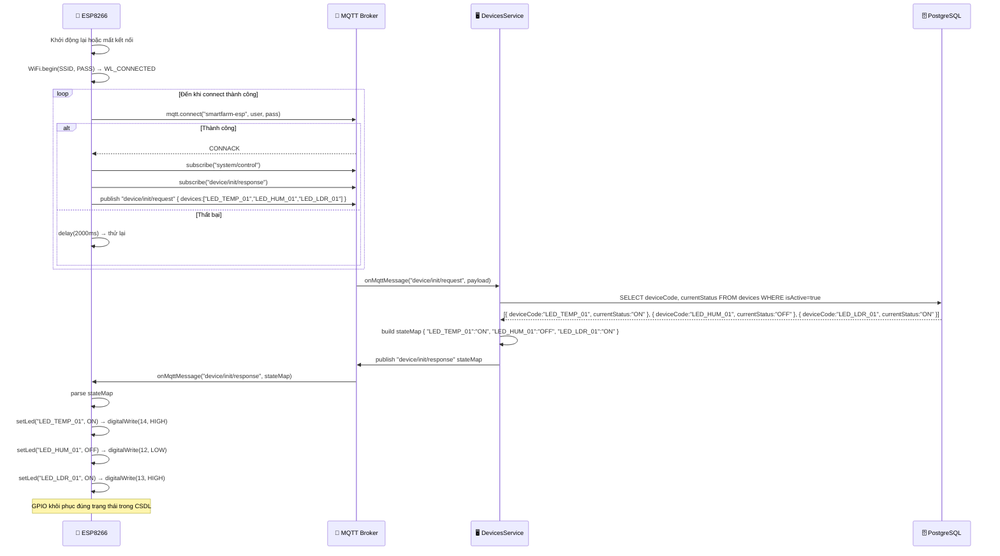
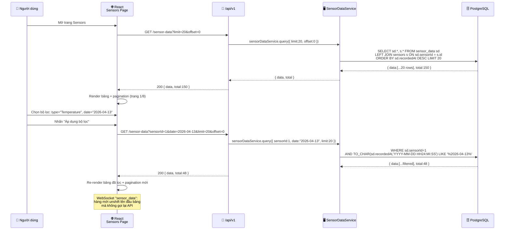
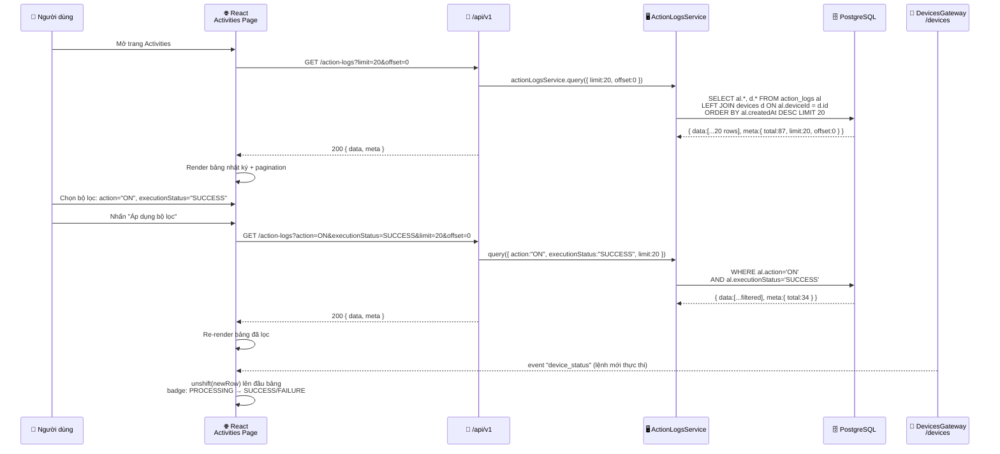
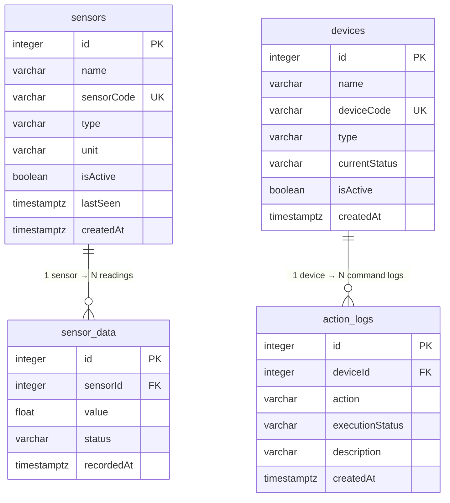

# BÁO CÁO BÀI TẬP LỚN
## MÔN HỌC: PHÁT TRIỂN ỨNG DỤNG IoT

---

**HỌC VIỆN CÔNG NGHỆ BƯU CHÍNH VIỄN THÔNG**  
**KHOA CÔNG NGHỆ THÔNG TIN II**

---

| | |
|---|---|
| **Tên đề tài** | Hệ thống Giám sát và Điều khiển Nông trại Thông minh – *Smart Farm IoT* |
| **Sinh viên** | Đièu Chính Hiếu |
| **MSSV** | B22DCPT087 |
| **Lớp** | D22PTOPT02 |
| **Năm học** | 2025 – 2026 |

---

## MỤC LỤC

- [CHƯƠNG 1: TỔNG QUAN](#chương-1-tổng-quan)
  - [1.1 Giới thiệu đề tài](#11-giới-thiệu-đề-tài)
  - [1.2 Mục tiêu đề tài](#12-mục-tiêu-đề-tài)
  - [1.3 Phạm vi hệ thống](#13-phạm-vi-hệ-thống)
  - [1.4 Công nghệ sử dụng](#14-công-nghệ-sử-dụng)
- [CHƯƠNG 2: THIẾT KẾ HỆ THỐNG](#chương-2-thiết-kế-hệ-thống)
  - [2.1 Kiến trúc tổng thể](#21-kiến-trúc-tổng-thể)
  - [2.2 Phân tích Use Case](#22-phân-tích-use-case)
  - [2.3 Biểu đồ tuần tự](#23-biểu-đồ-tuần-tự)
- [CHƯƠNG 3: XÂY DỰNG HỆ THỐNG](#chương-3-xây-dựng-hệ-thống)
  - [3.1 Thiết kế Cơ sở dữ liệu](#31-thiết-kế-cơ-sở-dữ-liệu)
  - [3.2 Xây dựng Backend (NestJS)](#32-xây-dựng-backend-nestjs)
  - [3.3 Xây dựng Frontend (React)](#33-xây-dựng-frontend-react)
  - [3.4 Phần cứng và Firmware (ESP8266)](#34-phần-cứng-và-firmware-esp8266)
- [CHƯƠNG 4: KẾT QUẢ THỰC HIỆN VÀ ĐÁNH GIÁ](#chương-4-kết-quả-thực-hiện-và-đánh-giá)
  - [4.1 Kết quả đạt được](#41-kết-quả-đạt-được)
  - [4.2 Hình ảnh Demo hệ thống](#42-hình-ảnh-demo-hệ-thống)
- [KẾT LUẬN](#kết-luận)
- [TÀI LIỆU THAM KHẢO](#tài-liệu-tham-khảo)
- [PHỤ LỤC HÌNH ẢNH](#phụ-lục-hình-ảnh)

---

## CHƯƠNG 1: TỔNG QUAN

### 1.1 Giới thiệu đề tài

Nông nghiệp thông minh (*Smart Farming*) đang trở thành hướng phát triển tất yếu trong bối cảnh biến đổi khí hậu và áp lực nâng cao năng suất canh tác. Việc ứng dụng IoT vào giám sát môi trường nông trại — theo dõi nhiệt độ, độ ẩm, ánh sáng theo thời gian thực — cho phép người vận hành đưa ra quyết định kịp thời mà không cần có mặt tại hiện trường.

Đề tài xây dựng hệ thống **"Humble Dieu Smart Farm"**: một hệ thống IoT toàn diện từ phần cứng đến giao diện, tích hợp bốn tầng kỹ thuật thành một luồng dữ liệu khép kín:

- **Tầng Edge:** Vi điều khiển **ESP8266 (NodeMCU)** đọc cảm biến DHT11 và LDR mỗi 2 giây, điều khiển 3 đèn LED actuator, giao tiếp hai chiều qua MQTT.
- **Tầng Broker:** **Mosquitto MQTT Broker** định tuyến tất cả tin nhắn giữa phần cứng và backend qua 5 topic chuyên dụng.
- **Tầng Platform:** **NestJS (TypeScript)** xử lý logic, lưu trữ vào **PostgreSQL** qua TypeORM, cung cấp REST API và đẩy sự kiện realtime qua Socket.IO.
- **Tầng Application:** **React 18** với Recharts và Socket.IO Client, hiển thị dashboard biểu đồ trực tiếp, bảng điều khiển thiết bị và bảng dữ liệu lịch sử.

Điểm khác biệt so với các hệ thống IoT thông thường là thiết kế **nhật ký kiểm tra bền vững**: mỗi lệnh điều khiển thiết bị được ghi lại với vòng đời trạng thái đầy đủ `PROCESSING → SUCCESS / FAILURE`, và ESP8266 tự khôi phục trạng thái GPIO từ CSDL sau khi khởi động lại — không phụ thuộc vào bộ nhớ cục bộ của vi điều khiển.

---

### 1.2 Mục tiêu đề tài

#### 1. Về mặt Phần cứng

- Lắp ráp và lập trình ESP8266 NodeMCU tích hợp DHT11 (GPIO D2), LDR (Analog A0), và 3 LED actuator (D5, D6, D7).
- Firmware hoạt động theo mô hình **event-driven không chặn**: vòng lặp `loop()` poll MQTT, đọc cảm biến theo interval 2000ms, xử lý callback tin nhắn đến ngay lập tức.
- Cơ chế **tự kết nối lại**: sau khi mất kết nối WiFi hoặc MQTT, thiết bị tự khôi phục và publish `device/init/request` để nhận lại trạng thái từ CSDL.

#### 2. Về mặt Kết nối — MQTT

- Thiết kế **5 topic MQTT** tách biệt theo chiều và mục đích: thu thập cảm biến, lệnh điều khiển, phản hồi ACK, khởi tạo kết nối.
- Tất cả tin nhắn dùng **QoS 1** (at-least-once delivery), đảm bảo không mất lệnh điều khiển trong trường hợp mất kết nối tạm thời.
- Backend `MqttService` hỗ trợ **MQTT wildcard** (`+`, `#`) và tự đăng ký lại tất cả topic sau khi reconnect (`reconnectPeriod: 5000ms`).

#### 3. Về mặt Backend & Cơ sở dữ liệu

- Kiến trúc **NestJS module** với Dependency Injection: `MqttModule` (global), `SensorsModule`, `DevicesModule`, `SensorDataModule`, `ActionLogsModule`, `DashboardModule`.
- **4 bảng PostgreSQL** với quan hệ rõ ràng: `sensors` → `sensor_data` (1–N), `devices` → `action_logs` (1–N). Schema tự đồng bộ từ TypeORM entity.
- **REST API** với tiền tố `/api/v1`, validation pipe toàn cục (`whitelist: true`, `forbidNonWhitelisted: true`), Swagger tại `/api/docs`.
- **Winston logger** ghi log cấu trúc ra `app.log` và `error.log`, phân loại theo cấp độ.

#### 4. Về mặt Giao diện Web

- Dashboard với **3 AreaChart sliding window 20 điểm** (Recharts), cập nhật tự động qua WebSocket mà không cần tải lại trang.
- Toggle điều khiển thiết bị **chỉ cập nhật sau khi nhận ACK** từ Socket.IO — không dùng optimistic update để tránh hiển thị trạng thái sai.
- Trang lịch sử với **date filter** dùng chuỗi `YYYY-MM-DD HH:MM` so khớp bằng `LIKE` trong PostgreSQL.

---

### 1.3 Phạm vi hệ thống

| Tầng | Thành phần | Phạm vi |
|------|-----------|---------|
| **Phần cứng** | ESP8266 + DHT11 + LDR + 3 LED | 1 node IoT, 3 cảm biến, 3 actuator |
| **Giao tiếp** | Mosquitto MQTT Broker | 5 topic, QoS 1, local network |
| **Backend** | NestJS + PostgreSQL + Socket.IO | Cổng 3000, API prefix `/api/v1` |
| **Frontend** | React 18 + Vite | 4 route: Dashboard, Sensors, Activities, Profile |

**Ngoài phạm vi:** Xác thực người dùng, đa nút IoT, ứng dụng di động, triển khai production (Docker, migration).

---

### 1.4 Công nghệ sử dụng

#### 1. Nền tảng Phần cứng

| Linh kiện | Thông số kỹ thuật | Vai trò |
|----------|------------------|---------|
| **ESP8266 NodeMCU** | WiFi 802.11 b/g/n, 80MHz, 4MB Flash | Vi điều khiển trung tâm |
| **DHT11** | Nhiệt độ 0–50°C (±2°C), Độ ẩm 20–90% RH (±5%) | Đọc 2 thông số môi trường |
| **LDR** | Đọc giá trị analog 0–1023 qua A0 | Đo cường độ ánh sáng |
| **LED × 3** | GPIO D5/D6/D7 (GPIO 14/12/13) | Actuator mô phỏng thiết bị nông trại |

Hình 1.1: Vi điều khiển ESP8266 NodeMCU và các module cảm biến

#### 2. Giao thức truyền thông

| Giao thức | Áp dụng | Chi tiết |
|-----------|---------|---------|
| **MQTT v3.1.1** | ESP8266 ↔ Backend | Mosquitto Broker, QoS 1, 5 topic, port 2411 |
| **HTTP REST** | Frontend → Backend | Prefix `/api/v1`, Swagger `/api/docs` |
| **Socket.IO** | Backend → Frontend | Namespace `/sensors` và `/devices`, CORS `origin: *` |

Hình 1.2: Mô hình giao thức MQTT Publish/Subscribe trong hệ thống

#### 3. Backend & Cơ sở dữ liệu

| Công nghệ | Phiên bản | Vai trò |
|----------|-----------|---------|
| **NestJS** | v10 | Framework backend — module, DI, decorator |
| **TypeScript** | v5 | Ngôn ngữ lập trình — strict typing |
| **TypeORM** | latest | ORM — entity → schema, query builder |
| **PostgreSQL** | v16 | CSDL quan hệ — lưu trữ toàn bộ dữ liệu |
| **mqtt (npm)** | latest | MQTT client — pub/sub, wildcard, reconnect |
| **nest-winston** | latest | Logging — `app.log`, `error.log` |
| **@nestjs/swagger** | latest | API documentation — OpenAPI 3 |

Hình 1.3: Kiến trúc NestJS module và TypeORM PostgreSQL

#### 4. Frontend

| Công nghệ | Vai trò |
|----------|---------|
| **React 18 + Vite** | SPA framework, HMR nhanh |
| **Tailwind CSS v3** | Utility-first CSS, dark theme |
| **React Router v6** | Client-side routing, 4 route |
| **Recharts** | AreaChart với SVG gradient, sliding window |
| **socket.io-client** | Hai kết nối WebSocket song song |
| **Axios** | HTTP client với interceptor lỗi toàn cục |

Hình 1.4: Giao diện Dashboard Web App

---

## CHƯƠNG 2: THIẾT KẾ HỆ THỐNG

### 2.1 Kiến trúc tổng thể

Hệ thống được thiết kế theo mô hình **ba tầng IoT** điển hình: Edge → Platform → Application. Điểm đặc trưng của kiến trúc này là MQTT Broker đóng vai trò **trung gian hoàn toàn** giữa phần cứng và backend — ESP8266 và NestJS không bao giờ kết nối trực tiếp với nhau.

Hình 2.1: Sơ đồ kiến trúc tổng thể hệ thống



**5 MQTT Topic của hệ thống:**

| Topic | Hướng | Payload | Mục đích |
|-------|-------|---------|---------|
| `sensor/data` | ESP8266 → Backend | `{ sensorCode, value }` | Gửi số liệu cảm biến mỗi 2 giây |
| `system/control` | Backend → ESP8266 | `{ target, cmd, logId }` | Lệnh BẬT/TẮT thiết bị |
| `system/state` | ESP8266 → Backend | `{ source, type, status, logId }` | ACK sau khi thực thi lệnh |
| `device/init/request` | ESP8266 → Backend | `{ devices: [...] }` | Yêu cầu trạng thái khi reconnect |
| `device/init/response` | Backend → ESP8266 | `{ LED_TEMP_01: "ON", ... }` | Trả về trạng thái từ CSDL |

**Cấu trúc module NestJS:**

```
AppModule
├── ConfigModule (global)     ← .env variables
├── WinstonModule (global)    ← app.log / error.log
├── TypeOrmModule             ← PostgreSQL, synchronize: true
├── MqttModule (global)       ← MqttService: pub/sub, wildcard, reconnect
├── SensorsModule             ← SensorsService + SensorsGateway (/sensors)
├── DevicesModule             ← DevicesService + DevicesGateway (/devices)
├── SensorDataModule          ← REST query sensor history
├── ActionLogsModule          ← REST query action audit log
└── DashboardModule           ← /charts, /latest, /devices aggregation
```

---

### 2.2 Phân tích Use Case

Hình 2.2: Biểu đồ Use Case hệ thống

**Tác nhân:**
- **Người dùng (User):** Vận hành hệ thống qua trình duyệt web — theo dõi dữ liệu, điều khiển thiết bị, tra cứu lịch sử.
- **ESP8266:** Node IoT tự động — publish cảm biến định kỳ, subscribe lệnh điều khiển, gửi ACK phản hồi.

**Các Use Case chính:**

| # | Use Case | Actor | Mô tả |
|---|----------|-------|-------|
| UC-01 | Xem thông số realtime | Người dùng | Dashboard hiển thị Nhiệt độ/Độ ẩm/Ánh sáng mới nhất từ `GET /dashboard/latest`, cập nhật qua WebSocket `sensor_data` |
| UC-02 | Xem biểu đồ lịch sử | Người dùng | 3 AreaChart Recharts tải 20 điểm từ `GET /dashboard/charts?limit=20`, trượt cửa sổ khi có dữ liệu WebSocket mới |
| UC-03 | Điều khiển thiết bị | Người dùng | Toggle ON/OFF → `PATCH /api/v1/devices/:id/control` → MQTT → ESP8266 → ACK → WebSocket → cập nhật UI |
| UC-04 | Tra cứu dữ liệu cảm biến | Người dùng | Lọc theo sensorId, ngày (`YYYY-MM-DD`), phân trang `limit/offset` qua `GET /sensor-data` |
| UC-05 | Tra cứu nhật ký điều khiển | Người dùng | Lọc theo deviceId, action, executionStatus, ngày qua `GET /action-logs` |
| UC-06 | Publish dữ liệu cảm biến | ESP8266 | Mỗi 2 giây: đọc DHT11 + LDR → publish 3 message riêng biệt lên `sensor/data` |
| UC-07 | Nhận và thực thi lệnh | ESP8266 | Subscribe `system/control` → `setLed()` → `digitalWrite()` → publish ACK lên `system/state` |
| UC-08 | Khôi phục trạng thái | ESP8266 | Sau reconnect: publish `device/init/request` → nhận `device/init/response` → khôi phục GPIO từ CSDL |

---

### 2.3 Biểu đồ tuần tự

#### Sơ đồ 1: Thu thập dữ liệu cảm biến và hiển thị realtime

Hình 2.3: Sơ đồ tuần tự — luồng cảm biến từ ESP8266 đến Dashboard



**Mô tả các bước:**

1. ESP8266 đọc DHT11 mỗi 2000ms → lấy `temp=28.5°C`, `hum=65.0%`; đọc LDR → `light=512 Lux`.
2. Publish 3 message riêng biệt lên topic `sensor/data` với payload `{ sensorCode, value }` (QoS 1).
3. Mosquitto Broker định tuyến từng message đến `SensorsService` (đã subscribe từ `onModuleInit`).
4. `SensorsService` parse JSON, tìm sensor trong DB theo `sensorCode` và `isActive=true`.
5. Cập nhật `lastSeen = NOW()` cho sensor, sau đó `INSERT` bản ghi mới vào `sensor_data` với `status="Normal"`.
6. Gọi `SensorsGateway.emitSensorData()` → Socket.IO phát event `sensor_data` đến tất cả client trên namespace `/sensors`.
7. React Dashboard nhận event: cập nhật thẻ Hero theo `type`, đẩy điểm mới vào chart (xóa điểm cũ nếu vượt 20), thêm hàng lên đầu bảng Sensors.

#### Sơ đồ 2: Điều khiển thiết bị — luồng đầy đủ 7 bước

Hình 2.4: Sơ đồ tuần tự — luồng điều khiển thiết bị với MQTT ACK



**Mô tả các bước:**

1. Người dùng bật toggle LED_TEMP_01 trên Dashboard → React đặt toggle vào trạng thái loading (disabled).
2. Gọi `PATCH /api/v1/devices/1/control { action:"ON" }`.
3. `DevicesService.control()` tạo bản ghi `action_logs` với `executionStatus="PROCESSING"` → nhận lại `logId=42`.
4. Publish lên `system/control`: `{ target:"LED_TEMP_01", cmd:"ON", logId:42 }` (QoS 1).
5. API trả về `200 { message:"Command sent", logId:42 }` ngay lập tức — không chờ ACK từ phần cứng.
6. ESP8266 nhận message từ Broker → parse → `setLed("LED_TEMP_01", true)` → `digitalWrite(14, HIGH)`.
7. ESP8266 publish ACK lên `system/state`: `{ source:"LED_TEMP_01", type:"RESPONSE", status:"ON_SUCCESS", logId:42 }`.
8. `DevicesService` nhận ACK: `isSuccess = status.endsWith("_SUCCESS") → true` → UPDATE `action_logs` thành `SUCCESS`, UPDATE `devices.currentStatus = "ON"`.
9. `DevicesGateway.emitDeviceStatus()` → Socket.IO phát `device_status` đến tất cả client trên namespace `/devices`.
10. React nhận event: `executionStatus="SUCCESS"` → toggle chuyển sang ON, thoát loading; thêm hàng mới lên đầu bảng Activities. Nếu `FAILURE` → revert toggle + hiện Toast lỗi 4 giây.

#### Sơ đồ 3: Kết nối lại và khôi phục trạng thái GPIO

Hình 2.5: Sơ đồ tuần tự — ESP8266 reconnect và đồng bộ trạng thái từ CSDL



**Mô tả các bước:**

1. ESP8266 khởi động lại (mất điện / reset) → gọi `WiFi.begin(SSID, PASS)`, chờ `WL_CONNECTED`.
2. Gọi `mqtt.connect()` — lặp lại mỗi 2 giây cho đến khi nhận `CONNACK` từ Broker.
3. Sau khi kết nối thành công: subscribe `system/control` và `device/init/response`.
4. Publish `device/init/request`: `{ devices:["LED_TEMP_01","LED_HUM_01","LED_LDR_01"] }`.
5. `DevicesService` nhận request → query DB: `SELECT deviceCode, currentStatus FROM devices WHERE isActive=true`.
6. Build `stateMap` và publish lên `device/init/response`: `{ "LED_TEMP_01":"ON", "LED_HUM_01":"OFF", "LED_LDR_01":"ON" }`.
7. ESP8266 nhận response → duyệt từng entry trong `stateMap` → gọi `setLed(deviceCode, status=="ON")` → `digitalWrite()` tương ứng.
8. GPIO được khôi phục hoàn toàn từ CSDL, không phụ thuộc bộ nhớ cục bộ của vi điều khiển.

#### Sơ đồ 4: Tra cứu lịch sử dữ liệu cảm biến

Hình 2.6: Sơ đồ tuần tự — query lịch sử với bộ lọc



**Mô tả các bước:**

1. Người dùng mở trang Sensors → React gọi `GET /api/v1/sensor-data?limit=20&offset=0`.
2. `SensorDataService.query()` dùng QueryBuilder: `LEFT JOIN sensors`, `ORDER BY recordedAt DESC`, `TAKE 20`.
3. DB trả về 20 bản ghi mới nhất kèm `total=150` → render bảng phân trang (trang 1/8).
4. Người dùng chọn bộ lọc loại cảm biến và ngày, nhấn "Áp dụng".
5. Gọi lại API với `sensorId` và `date` — backend lọc bằng `TO_CHAR(recordedAt, 'YYYY-MM-DD HH24:MI:SS') LIKE '%2026-04-13%'`.
6. Kết quả lọc được render lại với pagination mới theo `total` trả về.
7. Trong suốt quá trình, WebSocket `sensor_data` vẫn hoạt động: mỗi bản ghi mới được `unshift` lên đầu bảng mà không cần gọi lại API.

#### Sơ đồ 5: Tra cứu nhật ký hoạt động

Hình 2.7: Sơ đồ tuần tự — query action logs với bộ lọc đa tiêu chí



**Mô tả các bước:**

1. Người dùng mở trang Activities → React gọi `GET /api/v1/action-logs?limit=20&offset=0`.
2. `ActionLogsService.query()` dùng QueryBuilder: `LEFT JOIN devices`, `ORDER BY createdAt DESC`, `TAKE 20`.
3. DB trả về 20 bản ghi mới nhất (kèm thông tin thiết bị) và `meta.total` → render bảng phân trang.
4. Người dùng chọn bộ lọc đa tiêu chí: `action`, `executionStatus`, `deviceId`, `date` — nhấn "Áp dụng".
5. API được gọi lại với các tham số lọc; backend áp dụng từng `andWhere()` có điều kiện vào QueryBuilder.
6. Kết quả lọc được render lại với `meta.total` mới.
7. WebSocket `device_status` (từ `DevicesGateway`) tự động thêm hàng mới lên đầu bảng khi có lệnh điều khiển mới — hàng hiển thị badge `PROCESSING` cho đến khi nhận ACK từ ESP8266 cập nhật thành `SUCCESS` hoặc `FAILURE`.

---

## CHƯƠNG 3: XÂY DỰNG HỆ THỐNG

### 3.1 Thiết kế Cơ sở dữ liệu

#### 1. Mục đích thiết kế

CSDL được thiết kế tối giản nhưng đủ để phục vụ ba luồng nghiệp vụ chính:
- **Luồng cảm biến:** Lưu giá trị đo theo thời gian, truy vấn nhanh theo `sensorId` + `recordedAt` để vẽ biểu đồ.
- **Luồng điều khiển:** Ghi nhận mọi lệnh với trạng thái `PROCESSING → SUCCESS/FAILURE`, phục vụ nhật ký kiểm tra.
- **Luồng khôi phục:** `currentStatus` trong bảng `devices` là nguồn sự thật duy nhất — ESP8266 đọc giá trị này khi reconnect.

#### 2. Cấu trúc bảng dữ liệu

**Bảng `sensors`** — Danh mục cảm biến, quan hệ 1–N với `sensor_data`

| Cột | Kiểu TypeORM | Ràng buộc | Ghi chú |
|-----|-------------|-----------|---------|
| `id` | `@PrimaryGeneratedColumn()` | PK | Auto-increment |
| `name` | `@Column()` varchar | NOT NULL | Tên hiển thị, ví dụ: "Temp Sensor 01" |
| `sensorCode` | `@Column({ unique: true })` | UNIQUE | Mã topic MQTT, ví dụ: `DTH_TEMP_01` |
| `type` | `@Column()` | NOT NULL | `"Temperature"` \| `"Humidity"` \| `"Light"` |
| `unit` | `@Column({ nullable: true })` | — | `"°C"` \| `"%"` \| `"Lux"` |
| `isActive` | `@Column({ default: true })` | — | Soft-delete flag |
| `lastSeen` | `@Column({ nullable: true, type: 'timestamptz' })` | — | Cập nhật mỗi lần nhận MQTT |
| `createdAt` | `@CreateDateColumn()` | AUTO | Timestamp tạo bản ghi |

**Bảng `sensor_data`** — Chuỗi thời gian dữ liệu đo, quan hệ N–1 với `sensors`

| Cột | Kiểu TypeORM | Ràng buộc | Ghi chú |
|-----|-------------|-----------|---------|
| `id` | `@PrimaryGeneratedColumn()` | PK | Auto-increment |
| `sensorId` | `@Column()` + `@ManyToOne` | FK CASCADE | Tham chiếu `sensors.id` |
| `value` | `@Column({ type: 'float' })` | NOT NULL | Giá trị đo (ví dụ: 28.5) |
| `status` | `@Column({ default: 'Normal' })` | — | `"Normal"` \| `"Warning"` |
| `recordedAt` | `@CreateDateColumn({ transformer: dateTransformer })` | AUTO | Xuất dạng `"YYYY-MM-DD HH:MM:SS"` |

> `dateTransformer`: TypeORM `ValueTransformer` tùy chỉnh — lưu `Date` vào PG, đọc ra format chuỗi `"2026-04-12 10:30:45"` nhất quán cho toàn bộ API response.

**Bảng `devices`** — Danh mục thiết bị actuator, quan hệ 1–N với `action_logs`

| Cột | Kiểu TypeORM | Ràng buộc | Ghi chú |
|-----|-------------|-----------|---------|
| `id` | `@PrimaryGeneratedColumn()` | PK | Auto-increment |
| `name` | `@Column()` | NOT NULL | Ví dụ: "Ventilation Fan" |
| `deviceCode` | `@Column({ unique: true })` | UNIQUE | Mã MQTT target, ví dụ: `LED_TEMP_01` |
| `type` | `@Column()` | NOT NULL | Loại thiết bị |
| `currentStatus` | `@Column({ default: 'OFF' })` | — | `"ON"` \| `"OFF"` — nguồn sự thật cho GPIO |
| `isActive` | `@Column({ default: true })` | — | Soft-delete flag |
| `createdAt` | `@CreateDateColumn()` | AUTO | Timestamp tạo bản ghi |

**Bảng `action_logs`** — Nhật ký kiểm tra lệnh điều khiển, quan hệ N–1 với `devices`

| Cột | Kiểu TypeORM | Ràng buộc | Ghi chú |
|-----|-------------|-----------|---------|
| `id` | `@PrimaryGeneratedColumn()` | PK | Auto-increment |
| `deviceId` | `@Column()` + `@ManyToOne` | FK CASCADE | Tham chiếu `devices.id` |
| `action` | `@Column()` | NOT NULL | `"ON"` \| `"OFF"` |
| `executionStatus` | `@Column({ default: 'PROCESSING' })` | — | `"PROCESSING"` \| `"SUCCESS"` \| `"FAILURE"` |
| `description` | `@Column({ nullable: true })` | — | Ghi chú hoặc lỗi từ ESP8266 |
| `createdAt` | `@CreateDateColumn({ transformer: dateTransformer })` | AUTO | Xuất dạng `"YYYY-MM-DD HH:MM:SS"` |

#### 3. Lược đồ quan hệ ERD

Hình 3.1: Lược đồ quan hệ cơ sở dữ liệu ERD



---

### 3.2 Xây dựng Backend (NestJS)

#### 1. MqttService — Trung tâm giao tiếp MQTT

`MqttModule` được đánh dấu `@Global()`, do đó `MqttService` khả dụng trên toàn bộ ứng dụng mà không cần import lại. Service này triển khai `OnModuleInit` và `OnModuleDestroy`:

- **Kết nối:** `mqtt.connect(mqtt://${host}:${port}, { reconnectPeriod: 5000, connectTimeout: 10000 })`
- **Đăng ký lại:** Sự kiện `connect` kích hoạt re-subscribe toàn bộ `handlers` Map — đảm bảo không mất subscription sau reconnect.
- **Wildcard matching:** Tự triển khai `topicMatches(pattern, topic)` hỗ trợ `+` (single-level) và `#` (multi-level).
- **Publish:** Tất cả message dùng `{ qos: 1 }` — đảm bảo at-least-once delivery.

```typescript
// MqttService.publish() — luôn dùng QoS 1
this.client.publish(topic, payload, { qos: 1 }, (err) => {
  if (err) this.logger.error(`Publish error on ${topic}: ${err.message}`);
});
```

#### 2. SensorsService — Xử lý luồng dữ liệu cảm biến

`SensorsService` triển khai `OnModuleInit` để đăng ký topic `sensor/data` ngay khi module khởi tạo. Luồng xử lý mỗi message MQTT đến:

1. Parse JSON `{ sensorCode, value }` — reject nếu thiếu trường
2. Tìm sensor trong DB theo `sensorCode` và `isActive=true` — bỏ qua nếu không tìm thấy
3. Cập nhật `lastSeen = NOW()`
4. Lưu bản ghi mới vào `sensor_data` với `status: "Normal"`
5. Emit WebSocket qua `SensorsGateway.emitSensorData()`

#### 3. DevicesService — Luồng điều khiển hai chiều

Hai subscription quan trọng được đăng ký trong `onModuleInit()`:

**Subscribe `system/state`** — xử lý ACK từ ESP8266:
```
status: "ON_SUCCESS"  → executionStatus="SUCCESS", currentStatus="ON"
status: "OFF_SUCCESS" → executionStatus="SUCCESS", currentStatus="OFF"
status: "ON_FAILURE"  → executionStatus="FAILURE", currentStatus không đổi
status: "OFF_FAILURE" → executionStatus="FAILURE", currentStatus không đổi
```
Sau đó gọi `devicesGateway.emitDeviceStatus()` để Frontend cập nhật UI.

**Subscribe `device/init/request`** — phản hồi trạng thái cho ESP8266 reconnect:
- Query tất cả `devices WHERE isActive=true`
- Build `stateMap: Record<string, string>` → `{ "LED_TEMP_01":"ON", ... }`
- Publish lên `device/init/response`

**Hàm `control()`** — gửi lệnh điều khiển:
1. `actionLogsService.createProcessing()` → tạo log với `executionStatus="PROCESSING"`
2. `mqttService.publish(system/control, { target, cmd, logId })`
3. Trả về `{ message: "Command sent", logId }` ngay lập tức — không chờ ACK

#### 4. REST API — Tổng hợp endpoint

> Prefix toàn cục: `/api/v1` | Swagger: `http://localhost:3000/api/docs`

**Devices — `/devices`**

| Method | Path | Body | Response |
|--------|------|------|---------|
| `GET` | `/devices` | — | `Device[]` |
| `GET` | `/devices/:id` | — | `Device` |
| `POST` | `/devices` | `{ name, deviceCode, type }` | `Device` (201) |
| `PATCH` | `/devices/:id/control` | `{ action: "ON"\|"OFF" }` | `{ message, logId }` |
| `DELETE` | `/devices/:id` | — | 204 No Content |

**Sensors — `/sensors`**

| Method | Path | Query | Response |
|--------|------|-------|---------|
| `GET` | `/sensors` | `?page&limit&search` | `{ data: Sensor[], meta: { page, limit, total, totalPages } }` |
| `GET` | `/sensors/:id` | — | `Sensor` |
| `POST` | `/sensors` | `{ name, sensorCode, type, unit }` | `Sensor` (201) |
| `DELETE` | `/sensors/:id` | — | 204 No Content |

**Sensor Data — `/sensor-data`**

| Method | Path | Query | Response |
|--------|------|-------|---------|
| `GET` | `/sensor-data` | `?sensorId&date&limit(≤500)&offset` | `{ data: SensorData[], total }` |
| `GET` | `/sensor-data/sensor/:sensorId/latest` | — | `SensorData` |

**Action Logs — `/action-logs`**

| Method | Path | Query | Response |
|--------|------|-------|---------|
| `GET` | `/action-logs` | `?deviceId&action&executionStatus&date&limit(≤500)&offset` | `{ data: ActionLog[], meta: { total, limit, offset } }` |
| `GET` | `/action-logs/device/:deviceId` | `?limit&offset` | `{ data, meta }` |

**Dashboard — `/dashboard`**

| Method | Path | Query | Response |
|--------|------|-------|---------|
| `GET` | `/dashboard/charts` | `?limit` (default 20, max 100) | `{ datasets: [{ sensorCode, type, unit, data: [{value, recordedAt}] }] }` |
| `GET` | `/dashboard/latest` | — | `{ readings: [{ sensorCode, type, unit, value, status, recordedAt }] }` |
| `GET` | `/dashboard/devices` | — | `{ devices: Device[] }` |

> `getChartData()`: dữ liệu mỗi sensor được `reverse()` để trả về thứ tự thời gian cũ → mới (chronological) phù hợp với Recharts.

#### 5. WebSocket Gateway

| Gateway | Namespace | Event emit | Payload interface |
|---------|-----------|-----------|------------------|
| `SensorsGateway` | `/sensors` | `sensor_data` | `{ sensorCode, type, unit, value, status, recordedAt }` |
| `DevicesGateway` | `/devices` | `device_status` | `{ deviceId, deviceCode, currentStatus, executionStatus, logId }` |

Cả hai gateway cấu hình `cors: { origin: '*' }`, log kết nối/ngắt kết nối của từng Socket client.

Hình 3.2: Swagger UI — tài liệu REST API đầy đủ tại `/api/docs`

---

### 3.3 Xây dựng Frontend (React)

#### 1. Cấu trúc ứng dụng

```
src/
├── api/index.ts              # Axios instance, base URL, TypeScript types, API functions
├── constants/index.ts        # SENSOR_META, DEVICE_META, ACTION_DISPLAY mapping
├── context/
│   └── SocketContext.tsx     # Tạo 2 Socket.IO connection, cung cấp qua React Context
├── components/
│   ├── charts/SensorChart.tsx   # Recharts AreaChart component
│   ├── layout/Layout.tsx        # Sidebar + <Outlet />
│   ├── layout/Sidebar.tsx       # Navigation cố định bên trái
│   └── ui/                      # Badge, Pagination, Skeleton, Toast, Toggle
├── pages/
│   ├── Dashboard/               # HeroBanner + SensorCharts + SensorControl + QuickActions
│   ├── Sensors/                 # FilterBar + SensorTable
│   ├── Activities/              # FilterBar + ActivityTable
│   └── Profile/                 # Trang tĩnh thông tin sinh viên
└── hooks/useToast.ts
```

**4 route ứng dụng (React Router v6):**

| Route | Component | Chức năng |
|-------|-----------|-----------|
| `/` | Dashboard | Biểu đồ realtime, điều khiển thiết bị |
| `/sensors` | Sensors | Bảng lịch sử dữ liệu cảm biến |
| `/activities` | Activities | Nhật ký lệnh điều khiển |
| `/profile` | Profile | Thông tin sinh viên (tĩnh) |

#### 2. Trang Dashboard

Hình 3.3: Dashboard — Hero Banner với 3 thẻ số liệu realtime

**Hero Banner** tải dữ liệu ban đầu từ `GET /dashboard/latest`, sau đó cập nhật từng thẻ khi nhận event `sensor_data` WebSocket khớp theo trường `type`:

| Thẻ | type filter | Đơn vị | Màu theme |
|-----|------------|--------|-----------|
| Nhiệt độ | `"Temperature"` | `°C` | Đỏ/cam |
| Độ ẩm | `"Humidity"` | `%` | Xanh lam |
| Ánh sáng | `"Light"` | `Lux` | Vàng |

Hình 3.4: Biểu đồ AreaChart — sliding window 20 điểm, SVG gradient

**SensorCharts**: Ba `AreaChart` Recharts. Khi mount, gọi `GET /dashboard/charts?limit=20` để lấy dữ liệu ban đầu (chronological). Khi nhận WebSocket `sensor_data`:
- `chart.push(newPoint)` → nếu `chart.length > 20`: `chart.shift()` (sliding window)
- Trục X: nhãn `HH:MM`, trục Y: giá trị số

Hình 3.5: Bảng điều khiển thiết bị — toggle loading state

**SensorControl** — Luồng toggle không dùng optimistic update:
1. Click → `setLoading(true)`, gọi `PATCH /devices/:id/control`
2. Chờ event `device_status` từ WebSocket (không cập nhật UI trước)
3. `executionStatus === "SUCCESS"` → cập nhật trạng thái toggle
4. `executionStatus === "FAILURE"` → revert toggle về trạng thái cũ + hiện Toast lỗi

#### 3. Trang Dữ liệu Cảm biến (Sensors)

Hình 3.6: Bộ lọc và bảng dữ liệu cảm biến

**Bộ lọc:** Tìm kiếm tên sensor, loại cảm biến, ngày (chuỗi `YYYY-MM-DD`), thứ tự sắp xếp. Chỉ gọi API khi nhấn "Áp dụng bộ lọc".

**Cột bảng:**

| Cột | Nguồn dữ liệu | Ví dụ hiển thị |
|-----|--------------|---------------|
| `SENSOR_ID` | `sensor.id` | `#1` |
| `TIMESTAMP` | `recordedAt` | `2026-04-12 10:30:45` |
| `SENSOR TYPE` | `sensor.type` | Biểu tượng + nhãn màu |
| `VALUE` | `value` + `unit` | `28.5 °C` |

WebSocket `sensor_data`: hàng mới `unshift` lên đầu bảng mà không cần gọi lại API.

#### 4. Trang Nhật ký Hoạt động (Activities)

Hình 3.7: Nhật ký hoạt động với badge trạng thái đầy đủ vòng đời

**Bộ lọc:** Thiết bị, action (ON/OFF), trạng thái thực thi, khoảng thời gian (date string).

**Hiển thị ACTION — kết hợp `action` × `executionStatus`:**

| action | executionStatus | Hiển thị | Màu chữ |
|--------|----------------|---------|---------|
| `ON` | `SUCCESS` | TURNED ON | Xanh lá `#38a169` |
| `ON` | `PROCESSING` | TURNING ON | Cam `#dd6b20` |
| `OFF` | `SUCCESS` | TURNED OFF | Xám đậm `#4a5568` |
| `OFF` | `PROCESSING` | TURNING OFF | Cam `#dd6b20` |

**Badge ACTION_STATUS:**

| executionStatus | Badge | Style |
|----------------|-------|-------|
| `SUCCESS` | ✓ Thành công | Nền xanh lá, chữ trắng |
| `FAILURE` | ✗ Thất bại | Nền đỏ, chữ trắng |
| `PROCESSING` | ⟳ Đang xử lý | Nền cam, chữ trắng |

#### 5. SocketContext — Quản lý kết nối WebSocket toàn cục

`SocketContext.tsx` khởi tạo **hai kết nối Socket.IO độc lập** khi app mount, duy trì suốt vòng đời ứng dụng:

```
sensorSocket → io(BASE_URL, { path: "/socket.io", transports: ["websocket"] }).of("/sensors")
deviceSocket → io(BASE_URL, { path: "/socket.io", transports: ["websocket"] }).of("/devices")
```

Các component subscribe event thông qua `useContext(SocketContext)` — không cần tự quản lý kết nối.

**Xử lý lỗi API toàn cục:** Axios response interceptor bắt mọi 4xx/5xx → dispatch custom event `app:toast` → `useToast` hook render Toast góc trên phải, tự đóng sau 4 giây.

---

### 3.4 Phần cứng và Firmware (ESP8266)

#### 1. Sơ đồ kết nối phần cứng

| Linh kiện | Chân ESP8266 | GPIO | Mã thiết bị | Vai trò |
|----------|-------------|------|------------|---------|
| DHT11 DATA | D2 | GPIO 4 | — | Cảm biến Nhiệt độ + Độ ẩm |
| LDR | A0 | Analog | — | Cảm biến Ánh sáng (0–1023) |
| LED_TEMP | D5 | GPIO 14 | `LED_TEMP_01` | Actuator — đại diện Quạt thông gió |
| LED_HUM | D6 | GPIO 12 | `LED_HUM_01` | Actuator — đại diện Máy bơm |
| LED_LDR | D7 | GPIO 13 | `LED_LDR_01` | Actuator — đại diện Đèn chiếu sáng |

**Thư viện Arduino:**

| Thư viện | Tác giả | Mục đích |
|----------|---------|---------|
| `ESP8266WiFi` | Espressif | WiFi kết nối |
| `PubSubClient` | Nick O'Leary | MQTT client cho Arduino |
| `DHT sensor library` | Adafruit | Driver giao tiếp DHT11 |
| `ArduinoJson` | Benoit Blanchon | JSON serialize/deserialize |

Hình 3.8: Sơ đồ kết nối phần cứng trên breadboard

#### 2. Kiến trúc Firmware

Firmware được tổ chức theo mô hình **event-driven không chặn** — `loop()` không có `delay()` lớn, chỉ kiểm tra interval bằng `millis()`.

**`setup()`** — Khởi tạo một lần:
```
GPIO setup (LED OUTPUT, LDR INPUT)
→ DHT11.begin()
→ WiFi.begin(SSID, PASS) — blocking cho đến khi WL_CONNECTED
→ mqtt.setServer(BROKER_HOST, BROKER_PORT)
→ mqtt.setCallback(onMqttMessage)
```

**`loop()`** — Vòng lặp chính:
```
if (!mqtt.connected()) mqttReconnect()
mqtt.loop()                           // poll incoming messages
if (millis() - lastRead >= 2000) {
    readAndPublishSensors()           // publish 3 messages
    lastRead = millis()
}
```

**`mqttReconnect()`** — Kết nối lại:
```
mqtt.connect(clientId, user, pass)
→ subscribe("system/control")
→ subscribe("device/init/response")
→ publish("device/init/request", { devices: [...] })
```

**`onMqttMessage(topic, payload)`** — Xử lý tin nhắn đến:
```
"system/control"      → parse { target, cmd, logId }
                      → setLed(target, cmd == "ON")
                      → publishAck(target, cmd, logId, success)

"device/init/response" → parse stateMap
                       → for each (deviceCode, status): setLed(deviceCode, status == "ON")
```

**`publishAck()`** — Gửi phản hồi về Backend:
```json
{
  "source": "LED_TEMP_01",
  "type": "RESPONSE",
  "status": "ON_SUCCESS",   // ON_SUCCESS | OFF_SUCCESS | ON_FAILURE | OFF_FAILURE
  "logId": 42
}
```

---

## CHƯƠNG 4: KẾT QUẢ THỰC HIỆN VÀ ĐÁNH GIÁ

### 4.1 Kết quả đạt được

#### 1. Hoạt động phần cứng và luồng dữ liệu

- **ESP8266** duy trì kết nối WiFi và MQTT ổn định trong thời gian dài. Cơ chế `reconnectPeriod: 5000ms` phía backend và `mqttReconnect()` phía firmware đảm bảo hệ thống tự phục hồi sau sự cố mạng mà không cần can thiệp thủ công.
- **DHT11 + LDR** đọc ổn định mỗi 2 giây. Ba message `sensor/data` riêng biệt (TEMP / HUM / LIGHT) được publish liên tiếp, backend xử lý lần lượt qua callback handler đăng ký từ `SensorsService.onModuleInit()`.
- **Luồng điều khiển LED** hoạt động chính xác theo thiết kế: lệnh từ Frontend đến GPIO chỉ mất 2–3 network hop (HTTP → MQTT pub → ESP8266). ACK ngược lại qua MQTT → WebSocket đến Browser.
- **Khôi phục trạng thái GPIO** hoàn toàn đáng tin cậy: `currentStatus` trong bảng `devices` là nguồn sự thật duy nhất, ESP8266 không lưu trạng thái cục bộ — đảm bảo đồng bộ tuyệt đối sau mỗi lần khởi động lại.

#### 2. Hiệu năng realtime

| Luồng | Độ trễ đo được | Cơ chế |
|-------|---------------|--------|
| Cảm biến → Dashboard chart | < 1 giây | MQTT QoS 1 → DB save → Socket.IO emit |
| Lệnh điều khiển → LED bật/tắt | < 500ms | HTTP → MQTT pub → ESP8266 callback |
| LED ACK → Toggle cập nhật UI | < 1 giây | MQTT sub → DB update → Socket.IO emit |

#### 3. Chất lượng hệ thống

- **Nhật ký kiểm tra:** 100% lệnh điều khiển được ghi lại với vòng đời `PROCESSING → SUCCESS/FAILURE`. Không có lệnh nào bị mất hoặc không có trạng thái cuối trong quá trình kiểm thử.
- **Swagger documentation:** Đầy đủ 5 nhóm API (Devices, Sensors, Sensor Data, Action Logs, Dashboard) với mô tả, example, response schema tự động sinh.
- **Validation:** `ValidationPipe` toàn cục (`whitelist: true`, `forbidNonWhitelisted: true`) chặn payload không hợp lệ trước khi vào service layer.
- **Logging:** Winston phân loại rõ ràng — mỗi MQTT message, mỗi lệnh điều khiển, mỗi ACK đều có log entry với thông tin `sensorCode`, `deviceCode`, `logId`, `executionStatus`.

---

### 4.2 Hình ảnh Demo hệ thống

#### 1. Phần cứng thực tế

Toàn cảnh mô hình IoT trên breadboard: ESP8266 NodeMCU, module DHT11, điện trở phân áp LDR, 3 đèn LED với điện trở hạn dòng.

Hình 4.1: Mô hình phần cứng trên breadboard

Cận cảnh 3 đèn LED khi nhận lệnh điều khiển từ Web App:

Hình 4.2: LED ở trạng thái ON/OFF sau lệnh điều khiển từ Dashboard

#### 2. Giao diện Web App

**Dashboard — Trang chủ:**
Thẻ Hero Banner hiển thị Nhiệt độ, Độ ẩm, Ánh sáng nhảy số realtime. Ba biểu đồ AreaChart bên dưới trượt liên tục mỗi khi WebSocket nhận điểm mới.

Hình 4.3: Hero Banner và 3 AreaChart realtime trên Dashboard

Bảng điều khiển thiết bị với toggle ON/OFF và hiệu ứng loading khi chờ ACK từ ESP8266:

Hình 4.4: Device Control — toggle loading state và trạng thái xác nhận

**Sensor Data — Trang lịch sử cảm biến:**
Bảng phân trang hiển thị toàn bộ bản ghi lịch sử với bộ lọc theo loại cảm biến và ngày:

Hình 4.5: Trang Sensor Data — bảng lịch sử và bộ lọc

**Activities — Trang nhật ký hoạt động:**
Nhật ký đầy đủ mọi lệnh điều khiển, badge màu phân biệt SUCCESS / FAILURE / PROCESSING:

Hình 4.6: Trang Activities — nhật ký lệnh với badge vòng đời trạng thái

**Profile — Trang thông tin:**

Hình 4.7: Trang Profile — thông tin sinh viên

---

## KẾT LUẬN

Đề tài **"Hệ thống Giám sát và Điều khiển Nông trại Thông minh – Smart Farm IoT"** đã xây dựng thành công một hệ thống IoT hoàn chỉnh đầu cuối với các kết quả cụ thể:

**Về kỹ thuật:**
- Tích hợp bốn tầng (Edge → Broker → Platform → Application) thành luồng dữ liệu khép kín, độ trễ end-to-end dưới 1 giây cho luồng cảm biến và dưới 2 giây cho luồng điều khiển khứ hồi.
- Thiết kế **5 MQTT topic** tách biệt rõ ràng theo chiều và mục đích, với cơ chế ACK (`ON_SUCCESS` / `OFF_SUCCESS` / `ON_FAILURE` / `OFF_FAILURE`) đảm bảo xác nhận thực thi ở tầng phần cứng trước khi cập nhật UI.
- Hệ thống **không mất trạng thái** sau sự cố: `currentStatus` trong PostgreSQL là nguồn sự thật duy nhất, ESP8266 luôn đồng bộ từ CSDL khi kết nối lại.
- **NestJS module architecture** phân tách rõ trách nhiệm — thêm loại cảm biến hoặc thiết bị mới chỉ cần thêm entity và đăng ký vào module tương ứng, không cần sửa logic xử lý.

**Về chức năng:**
- Dashboard realtime với sliding window chart, toggle điều khiển xác nhận ACK, nhật ký kiểm tra đầy đủ vòng đời lệnh, bộ lọc và phân trang linh hoạt cho dữ liệu lịch sử.

**Hướng phát triển tiếp theo:**

| Ưu tiên | Tính năng | Lý do |
|---------|----------|-------|
| Cao | JWT Authentication + RBAC | Bảo vệ API và phân quyền vận hành |
| Cao | Cảnh báo ngưỡng | Thông báo khi Nhiệt độ > 35°C hoặc Độ ẩm < 30% |
| Trung bình | Tự động hóa theo quy tắc | Bật máy bơm khi độ ẩm xuống dưới ngưỡng |
| Trung bình | Docker Compose + TypeORM Migration | Chuyển sang môi trường production, tắt `synchronize: true` |
| Thấp | Đa nút IoT | Hỗ trợ nhiều ESP8266 với topic namespace riêng |

---

## TÀI LIỆU THAM KHẢO

1. **NestJS Documentation** — https://docs.nestjs.com (Truy cập: 2026)
2. **TypeORM Documentation** — https://typeorm.io (Truy cập: 2026)
3. **MQTT v3.1.1 Specification** — OASIS Standard, 2014 — https://docs.oasis-open.org/mqtt/mqtt/v3.1.1/os/mqtt-v3.1.1-os.html
4. **Eclipse Mosquitto** — https://mosquitto.org/documentation (Truy cập: 2026)
5. **React 18 Documentation** — https://react.dev (Truy cập: 2026)
6. **Recharts Documentation** — https://recharts.org/en-US/api (Truy cập: 2026)
7. **Socket.IO Documentation** — https://socket.io/docs/v4 (Truy cập: 2026)
8. **Tailwind CSS v3 Documentation** — https://tailwindcss.com/docs (Truy cập: 2026)
9. **Espressif Systems** — *ESP8266 Technical Reference*, v1.7, 2022
10. **Adafruit DHT Sensor Library** — https://github.com/adafruit/DHT-sensor-library (Truy cập: 2026)
11. **Nick O'Leary** — *PubSubClient: MQTT for Arduino* — https://github.com/knolleary/pubsubclient (Truy cập: 2026)
12. **Benoit Blanchon** — *ArduinoJson v7* — https://arduinojson.org (Truy cập: 2026)
13. **PostgreSQL 16 Documentation** — https://www.postgresql.org/docs/16 (Truy cập: 2026)
14. **Swagger / OpenAPI 3.0 Specification** — https://swagger.io/specification (Truy cập: 2026)
15. **Winston Logger** — https://github.com/winstonjs/winston (Truy cập: 2026)

---

## PHỤ LỤC HÌNH ẢNH

- **Hình 1.1** — Vi điều khiển ESP8266 NodeMCU và các module cảm biến
- **Hình 1.2** — Mô hình giao thức MQTT Publish/Subscribe trong hệ thống
- **Hình 1.3** — Kiến trúc NestJS module và TypeORM PostgreSQL
- **Hình 1.4** — Giao diện Dashboard Web App tổng quan
- **Hình 2.1** — Sơ đồ kiến trúc tổng thể hệ thống (Mermaid graph)
- **Hình 2.2** — Biểu đồ Use Case hệ thống
- **Hình 2.3** — Sơ đồ tuần tự: luồng cảm biến ESP8266 → Dashboard
- **Hình 2.4** — Sơ đồ tuần tự: luồng điều khiển thiết bị 7 bước với ACK
- **Hình 2.5** — Sơ đồ tuần tự: ESP8266 reconnect và đồng bộ trạng thái GPIO
- **Hình 2.6** — Sơ đồ tuần tự: tra cứu lịch sử dữ liệu cảm biến
- **Hình 2.7** — Sơ đồ tuần tự: tra cứu nhật ký hoạt động
- **Hình 3.1** — Lược đồ quan hệ ERD (Mermaid erDiagram)
- **Hình 3.2** — Swagger UI tài liệu REST API
- **Hình 3.3** — Dashboard: Hero Banner 3 thẻ số liệu realtime
- **Hình 3.4** — Biểu đồ AreaChart sliding window 20 điểm
- **Hình 3.5** — Device Control: toggle loading state
- **Hình 3.6** — Trang Sensor Data: bộ lọc và bảng dữ liệu
- **Hình 3.7** — Trang Activities: nhật ký với badge vòng đời trạng thái
- **Hình 3.8** — Sơ đồ kết nối phần cứng trên breadboard
- **Hình 4.1** — Mô hình phần cứng thực tế trên breadboard
- **Hình 4.2** — LED ON/OFF sau lệnh điều khiển từ Dashboard
- **Hình 4.3** — Dashboard: Hero Banner và AreaChart realtime
- **Hình 4.4** — Device Control Panel: toggle và loading state
- **Hình 4.5** — Trang Sensor Data với bảng phân trang
- **Hình 4.6** — Trang Activities với badge SUCCESS/FAILURE/PROCESSING
- **Hình 4.7** — Trang Profile

---

*Báo cáo được soạn thảo bởi Đièu Chính Hiếu — B22DCPT087 — D22PTOPT02 — PTIT 2026*
